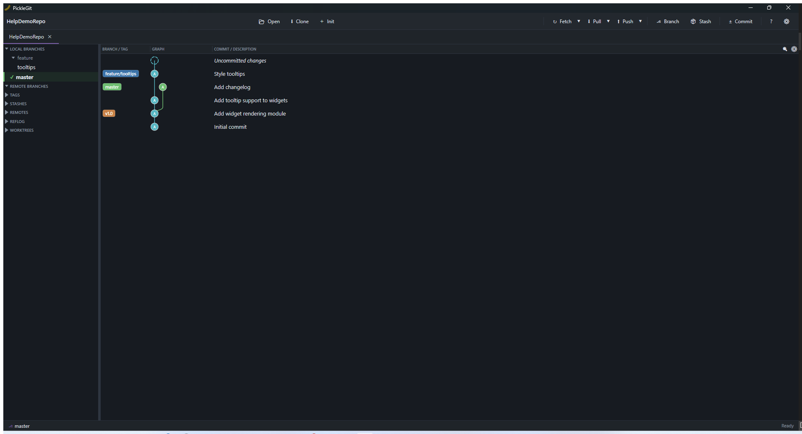

# Getting Started

PickleGit is a Git client with no dependency on `git.exe` for everyday reads — it talks to your
repository directly, and falls back to the real `git` command line only for the handful of
operations that require it (rebase, SSH/GPG, hunk staging). You can open, clone, or start a
repository from the toolbar in the top-left corner:

- **Open Repository** (`Ctrl+O`) — pick an existing local repository folder.
- **Clone Repository** (`Ctrl+Shift+N`) — clone a remote URL to a new local folder.
- **Initialize Repository** — turn a plain folder into a new git repository.

Each repository opens in its own tab, so you can work across multiple projects at once. Tabs can
be reordered by dragging them, and closed with `Ctrl+W`.

## Layout tour

- **Toolbar** — repository actions on the left (Open/Clone/Init), sync actions in the middle
  (Fetch/Pull/Push), and repository actions on the right (Branch, Stash, Commit, Settings).
- **Sidebar** (left) — local branches, remote branches, tags, and stashes, all in one flat,
  searchable list.
- **Commit graph** (center) — the commit history for the current branch (or all branches, if you
  toggle the branch filter off), with a graph column showing merges/branch points and colored
  branch/tag badges next to each commit that's a branch tip or tag.
- **Commit detail / staging panel** (right) — shows either the selected commit's file list and
  message, or, when nothing is selected, the working directory's staged/unstaged changes for
  building your next commit.
- **Diff view** (bottom) — opens when you select a file, showing the change side-by-side or
  unified depending on your preference.

## Finding things quickly

- `Ctrl+P` opens the **Command Palette** — search for any action by name instead of hunting
  through toolbars and menus.
- `Ctrl+F` jumps to the commit search box to filter the graph by message, author, or SHA.
- `Ctrl+1` focuses the commit list directly (handy after using the palette or search).
- `F5` refreshes the current tab; PickleGit also watches the repository folder and refreshes
  automatically when files change outside the app.

Next: [The Commit Graph](02-commit-graph.md) or [Staging & Committing](03-staging-and-committing.md).
