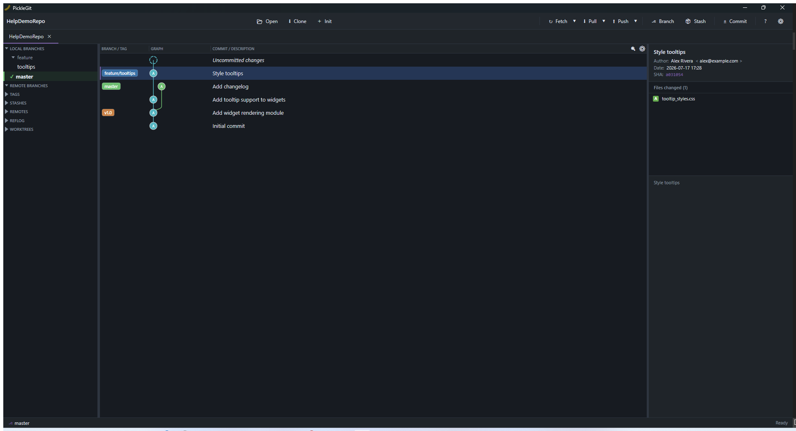

# The Commit Graph

The commit graph is the center column of the main window: one row per commit, with a small graph
drawing on the left showing how branches split and merge.

## Branch and tag badges

Commits that are the tip of a branch, or that carry a tag, show a colored badge with that
branch/tag's name in the **BRANCH/TAG** column. The currently checked-out branch's badge is
visually distinct from other local branches, remote branches, and tags.

- **Hover a badge for about a second** and every commit *not* reachable from that branch/tag fades
  to half-opacity, so you can see at a glance what's unique to it versus shared history. Move the
  mouse away and the graph fades back to full visibility. This works instantly no matter how many
  commits are in the graph — it reuses branch-reachability data computed once per refresh, not a
  fresh repository walk per hover.
- **Hover anywhere else on a commit's row** (its message, author, date, or SHA) and PickleGit shows
  faded badges for any additional branches/tags that commit belongs to but that aren't already
  shown on that row — useful for seeing "which branches contain this fix" without switching
  branches or filters.

## Selecting commits

Click a commit to see its full message and changed files in the right-hand panel. Ctrl-click or
Shift-click to select multiple commits — the file list becomes an aggregated view across all of
them. Selecting a single file opens its diff in the bottom pane.

## Filtering

- Type in the search box (`Ctrl+F`) to filter by commit message, author, or SHA.
- Toggle the branch filter to show only commits reachable from the current branch instead of the
  full repository history — this uses the same reachability data as the hover-highlight feature
  above, so switching the filter is instant even on large histories.

See also: [History Tools](08-history-tools.md) for comparing branches and bisecting.
