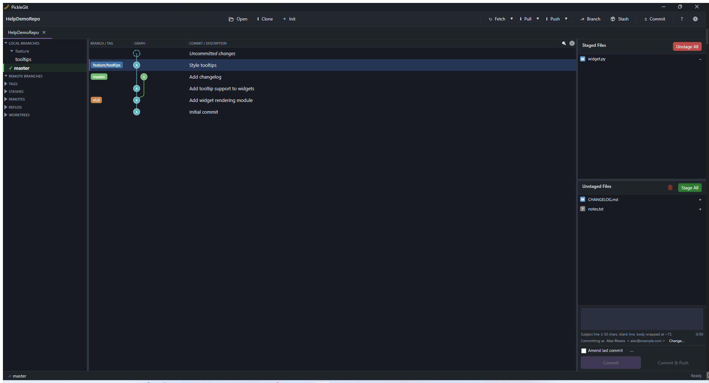

# Staging & Committing

Click the **±  Commit** toolbar button (or select nothing in the commit graph) to open the working
directory view in the right-hand panel: unstaged changes on top, staged changes below.

## Staging changes

- Stage or unstage an entire file from its row in either list.
- Open a file's diff in the bottom pane to stage or unstage individual **lines or hunks** instead
  of the whole file — click the checkbox/button next to a hunk header to stage just that hunk, or
  select specific lines first for finer control. `F7` / `Shift+F7` jump between hunks in the open
  diff.
- Discard a change from the unstaged list to throw it away entirely (this is destructive — PickleGit
  asks for confirmation).

## Writing the commit

- The **subject** field has a running character counter (`n/50`) as a guideline — good git
  practice keeps the subject line short, but PickleGit doesn't flag longer subjects as an error,
  since plenty of perfectly reasonable commit messages run past 50 characters.
- The larger text area below the subject is the commit **body**, for additional detail.
- Your commit's author name/email always comes from your configured git identity — shown as
  read-only text ("Committing as Name <email>") rather than editable fields, the same way
  SourceTree/GitKraken/Fork behave, so you can't accidentally commit under the wrong identity. Click
  **Change…** to open Settings → Profile if you need to update it (globally, or per-repository).
- **Amend last commit** replaces the most recent commit instead of creating a new one — useful for
  fixing a typo or adding a forgotten file before pushing.
- The **⋯** button next to Amend opens a small menu with **Sign-off**, which appends a
  `Signed-off-by:` trailer to the commit message using your git identity (common in projects that
  require a Developer Certificate of Origin).

Press the **Commit** button (or its keyboard shortcut, if you've bound one in
[Settings → Shortcuts](09-settings.md)) to create the commit.
