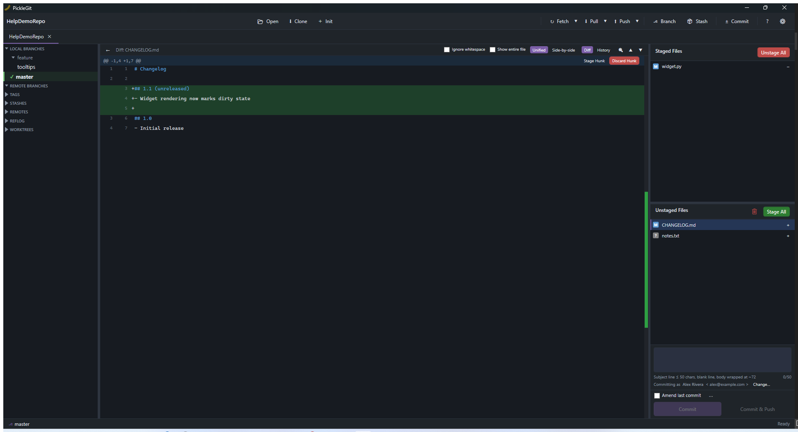

# The Diff View

Selecting a file — from a commit, from the working directory, or from a comparison (see
[History Tools](08-history-tools.md)) — opens its diff in the bottom pane.

## Unified vs. side-by-side

Toggle between a single unified column (added/removed lines interleaved) and a synced side-by-side
view (before/after in two scrolling-together columns) using the view switch in the diff pane's
toolbar. The **entire-file toggle** switches from "just the changed hunks with a little context"
to the complete file content, which is useful when a change only makes sense in light of
surrounding code that the default hunk view trims away.

## Staging from the diff

When viewing working-directory changes (not a historical commit), each hunk header has
Stage/Unstage/Discard controls, and you can select individual lines within a hunk before staging —
only the selected lines are staged, the rest of the hunk stays as-is. This is the same mechanism
described in [Staging & Committing](03-staging-and-committing.md), just reached from the diff
itself rather than the file list.

## Inline blame and history

Hover a line in the diff to see who last touched it and when (inline blame), or open that line's
full commit history without leaving the diff view — useful for understanding *why* a line looks
the way it does before you change it again.

## Navigating large diffs

- `F7` / `Shift+F7` jump to the next/previous hunk.
- A change-map strip alongside the scrollbar shows where the additions/deletions are in the file
  at a glance, so you can jump straight to the interesting parts of a large diff.
- Very large diffs render virtualized — only the visible rows are actually built — so scrolling
  stays smooth even on files with thousands of changed lines.
