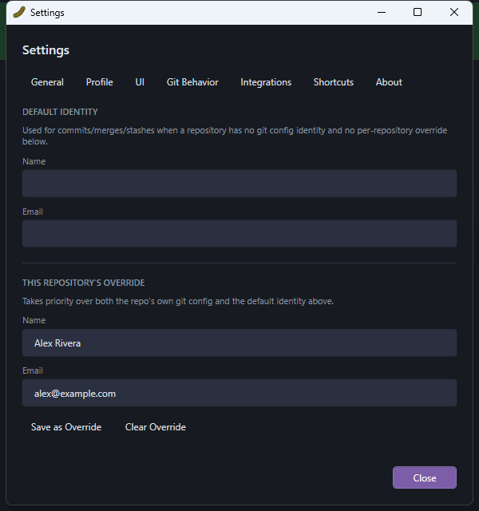

# Settings & Preferences

Open Settings from the **⚙** toolbar button, or the **?** Help button next to it opens this guide
instead. Settings is organized into sections down the left side:

- **General** — path to `git.exe` (only needed for operations LibGit2Sharp can't do itself, like
  rebase or SSH/GPG-signed operations — PickleGit degrades gracefully if it's not set), and other
  app-wide behavior.
- **Profile** — your git identity (name/email), used for every commit and sign-off. This can be
  set globally or per-repository; the commit panel's "Committing as…" line always reflects
  whichever one is currently active. See [Staging & Committing](03-staging-and-committing.md).
- **UI** — theme (Dark/Light — takes effect immediately, no restart needed), column visibility in
  the commit graph, and the date format used throughout the app.
- **Git Behavior** — defaults for operations like pull strategy (merge vs. rebase).
- **Integrations** — hosting credentials (personal access tokens) for GitHub/GitLab, including
  self-hosted/enterprise domains, used for [pull request creation](07-pull-requests.md).
- **Shortcuts** — every keyboard shortcut in the app, each rebindable; see
  [Keyboard Shortcuts](10-keyboard-shortcuts.md) for the default list.
- **About** — version info and the location of your settings file and logs, useful when reporting
  an issue.

Settings are stored in `%APPDATA%\PickleGit\settings.json`; the commit history cache lives
alongside it under `%APPDATA%\PickleGit\cache\`.
